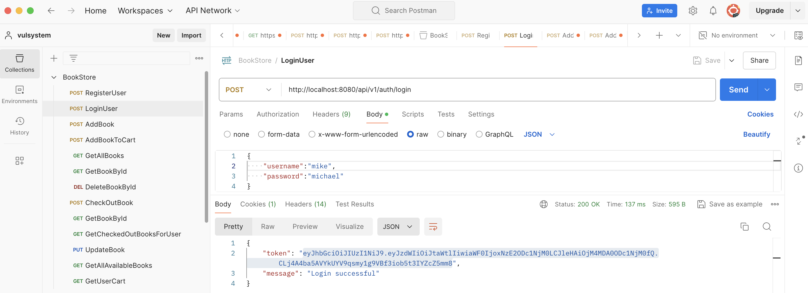
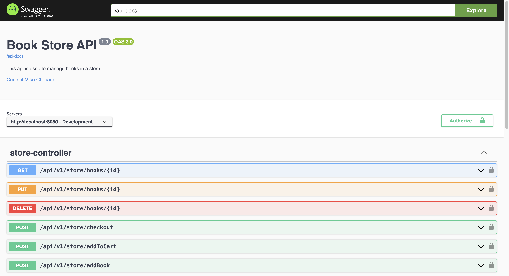

# Book Store Management System

This is a book store management system that allows users to manage books, authors, and categories. The system provides a user-friendly interface for adding, updating, and deleting book information. It also allows users to search for books by title, author, or category. The system is built using Java Spring Boot .

## Features

- **Swagger UI**: Interactive API documentation for easy testing and integration.
- **User Management**: Register, login, and manage user accounts.
- **JWT Authentication**: Secure user authentication using JSON Web Tokens.
- **Book Management**: Add, update, and delete books from the system.
- **Order Management**: Place orders for books and track order status.
- **RESTful API**: Exposes a set of RESTful APIs for seamless integration with other systems and applications.

## Technologies Used

- **Java 17**: Programming language for developing the application.
- **Spring Boot**: Provides a robust framework for building enterprise-level Java applications.
- **JUnit/Mockito**: For unit and integration testing.
- **Aspects**: For exception handling.
- **Spring Security**: For securing the application.
- **JWT**: For user authentication.
- **Swagger**: For API documentation.
- **H2 Database**: In-memory database for storing application data.
- **Maven**: For managing project dependencies.
- **Lombok**: For reducing boilerplate code.

## Getting Started

1. **Clone the Repository**: `git clone https://github.com/https://github.com/mikechiloane/book-store.git`
2. **Navigate to Project Directory**: `cd book-sotre`
3. **Build the Application**: `mvn clean install`
4. **Access the Application**: The application will be available on `http://localhost:8080`.
5. **Access Swagger UI**: The Swagger UI will be available on `http://localhost:8080/swagger-ui.html`.

## Postman Collection

You can use the Postman collection provided in the `docs` directory to test the RESTful APIs. The collection contains a set of requests for testing the various endpoints of the application.

## Swagger UI

The Swagger UI provides an interactive API documentation for testing the RESTful APIs. You can access the Swagger UI by navigating to `http://localhost:8080/swagger-ui.html`.

## License

This project is licensed under the [MIT License](LICENSE).

## Support

For any inquiries or support, feel free to contact the project maintainers at [mikechiloane@protonmail.com](mailto:mikechiloane@protonmail.com).

